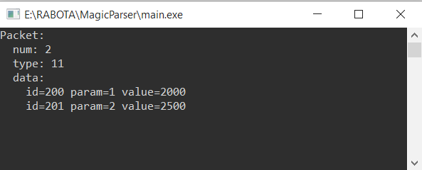

## Описание

В рамках задания был реализован парсер бинарного файла на языке C++ в виде консольного приложения.

Парсер выполняет:
- чтение бинарного файла в формате little-endian
- проверку сигнатуры файла (0xDEADBEEF)
- чтение пакетов и вложенных структур данных
- валидацию количества пакетов и элементов данных
- обработку ошибок чтения (обрезанные или повреждённые файлы)
- проверку на наличие лишних данных в конце файла
- защиту от некорректных значений (слишком большие размеры)

в папке docs есть полное ТЗ и пример работы программы.

## Запуск

### Компиляция
С помощью g++

В терминале выполнить команду:
    g++ main.cpp parser/*.cpp -I models -o main

затем:    
    .\main

### Запуск
Если у вас Windows x64 можно двойным щелчком по .exe, в случае ошибки запуска самостоятельно скомпилировать введя соответсвенно две команды выше в терминал

Пример работы программы:

##Особенность реализации:
Согласно заданному интерфейсу, метод парсинга возвращает только один пакет 
(std::optional<MagicPacket>), несмотря на то что файл может содержать несколько пакетов.

В связи с этим реализована следующая логика:
- все пакеты последовательно считываются и валидируются
- возвращается последний корректно прочитанный пакет
